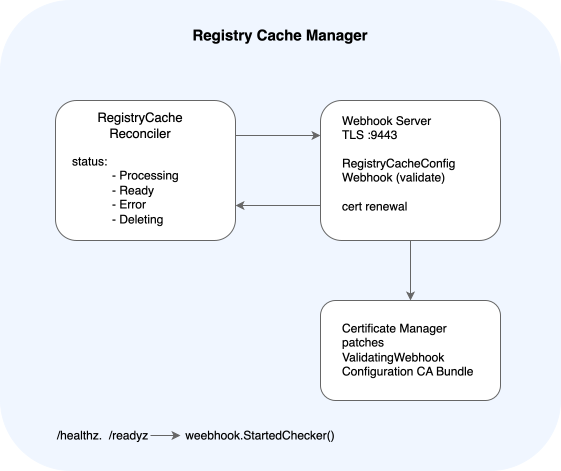

# Registry Cache Module

## What Is Registry Cache?

The Registry Cache module adds a caching layer for container image registries in SAP BTP, Kyma runtime instances.

Registry Cache reduces outbound traffic to upstream registries, improving image pull performance. With Registry Cache, you can also cache images from private registries. To do so, provide credentials for the caching layer to use when authenticating against those registries.

The Registry Cache module is built on top of [Gardener's Registry Cache extension](https://gardener.cloud/docs/extensions/others/gardener-extension-registry-cache/registry-cache/configuration/).

## Features

The Registry Cache module provides the following features:

- Caching container images from upstream registries to reduce outbound network traffic.
- Support for private registries using credential Secrets referenced in `RegistryCacheConfig`.
- Configurable cache volume size and storage class per upstream registry.
- Configurable garbage collection time to live (TTL) (you can disable garbage collection).
- Proxy support for HTTP and HTTPS connections used by the cache.
- TLS-enabled HTTP server for the Registry Cache endpoint.

## Architecture

The Registry Cache module consists of two main runtime components: the `RegistryCache` controller and the `RegistryCacheConfig` admission webhook. Both run in the same Registry Cache Manager process.

- `RegistryCache` controller — reconciles `RegistryCache` custom resources (CRs) and drives status transitions.
- Webhook Server — TLS server on port 9443 that validates `RegistryCacheConfig` resources on creation and update.
- Certificate Manager — watches TLS certificate files and rotates the CA bundle in `ValidatingWebhookConfiguration` on renewal.

## API / Custom Resource Definitions

The Registry Cache module defines two custom resources:

| CRD                   | Scope      | Description                                                                                                                                                                               |
|-----------------------|------------|-------------------------------------------------------------------------------------------------------------------------------------------------------------------------------------------|
| `RegistryCache`       | Namespaced | Module CR managed by the lifecycle infrastructure. Tracks the installation health of the Registry Cache module. See [RegistryCache Custom Resource](./resources/registry_cache_cr.md). |
| `RegistryCacheConfig` | Namespaced | User-created CR that configures a caching layer for a specific upstream container image registry. See [RegistryCacheConfig Custom Resource](./resources/registry_cache_config_cr.md).  |
